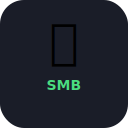

<div align="center">
  
  <h1>影序 YINGXU</h1>
  <p><strong>插卡之后，素材有序抵达</strong></p>
</div>

<p align="center">
  
  
  
  
</p>

---

## 📸 这是给谁用的？

**摄影师、视频创作者、无人机飞手。**

每次拍完：

- 手动把 SD 卡插电脑
- 手动拖文件到外置盘
- 手动按日期/设备建文件夹
- 手动分类照片和视频
- 手动校验怕拷坏了

**影序把这条链路变成一套可追溯的工作流：识别、归档、复制、校验、检索。**

---

## ✨ 功能

| 功能 | 说明 |
|------|------|
| 🚀 插卡即检测 | 插入 SD 卡自动弹窗 |
| 📷 自动读取元数据 | 相机型号、拍摄日期、GPS（需 exiftool） |
| 📁 自动分类 | 按设备→事件→照片/视频 自动整理 |
| 🔒 文件校验 | SHA256 校验，保证拷贝完整 |
| 📊 实时进度 | Web 面板进度条/速度/剩余时间 |
| 📋 历史记录 | 每次备份可查 |
| 💾 任意目标 | 本地磁盘、外置硬盘、NAS |
| 📱 Pocket 局域网接力 | 手机扫码配对后，把素材清单直接交给当前桌面端；不上传原始文件 |

## ✅ 当前 macOS 版本已经验证什么？

v1.0.11 是当前推荐的 macOS Apple Silicon 构建。它补强了取消/异常任务的安全状态、历史数据库计数与 JSON 报告一致性，并保留可继续备份提示。已在真实 SD 卡上完成 87 个照片/视频文件、约 8.66 GB 的复制与 SHA-256 校验；第二次重复执行会跳过 87 个已存在文件，不重复写入。设备识别已覆盖卡内 EXIF、目录提示和文件名提示，实测 Leica 与 Fujifilm 均可归类。

同时，自动化测试覆盖：无卡、目标空间不足、目标不可写、重复备份、损坏文件、网络不可用、进度重置、部分失败和相机识别。测试不会修改真实 SD 卡。

> macOS 安装包为未购买开发者账号的自签名/未公证构建。首次打开若遇到系统拦截，请在“系统设置 → 隐私与安全性”中允许，或右键 App 选择“打开”。

---

## 📁 目录结构

备份完成后，你的磁盘上长这样：

```
外置盘/
├── Sony ILCE-7M4/              ← 自动：按设备分类
│   └── 2025年8月漫展/           ← 你输入的事件名
│       ├── 照片/                ← 自动：照片和视频分开
│       │   ├── DSC01234.ARW    ← 保留原始文件名
│       │   ├── DSC01235.ARW
│       │   └── checksums.json  ← 校验清单
│       └── 视频/
│           ├── C0001.MP4
│           └── checksums.json
└── DJI Mavic 3/
    └── 2025年8月漫展/
        └── 视频/
            ├── DJI_0001.MP4
            └── checksums.json
```

**你只需要做 3 件事：** 插卡 → 输事件名 → 点开始

### 影序 Pocket（手机到电脑）

影序 Pocket 是无需开发者账号、无需云服务器的移动网页工作台：它只记录你选中素材的文件名、类型和大小，不读取、不上传、不删除手机原始文件。

1. 在桌面端「设置 → 高级」开启“允许 Pocket 局域网连接”，保存后重启影序。
2. 在仪表盘「影序 Pocket 接力」点“生成手机配对码”。
3. 手机和电脑连接同一 Wi‑Fi，扫描二维码；配对码 5 分钟有效。
4. 手机把收集箱清单直接发送到当前桌面端，再在桌面端用于本次备份任务。

桌面端关闭或重启后需要重新配对；这是为了避免长期暴露局域网访问权限。

---

## 🚀 快速开始

### 安装

```bash
pip install smart-media-backup
```

### 启动

```bash
smb
```

浏览器自动打开 → 看到仪表盘 → 插卡 → 开始备份。

---

## 🧑‍💻 用户指南

### 👨 摄影师（macOS / Windows）

1. 打开终端，输 `pip install smart-media-backup`
2. 再输 `smb` → 浏览器自动打开
3. 插 SD 卡 → 自动检测到设备/文件数量
4. 输入事件名（如"2025年8月漫展"）
5. 选择备份目标（本地盘 / 外置盘 / NAS）
6. 点「开始备份」
7. 看进度条 → 完成后弹通知

**每次只花 30 秒操作，剩下都是自动的。**

### 🥧 Pi Zero 2W 用户

详见树莓派安装指南。

---

## ⚙️ 高级

### CLI 模式

```bash
# 启动 Web 面板
smb web

# 快速扫描 SD 卡
smb scan
```

### 配置文件

`~/.config/smb/config.json`

```json
{
  "web_port": 8080,
  "verify_method": "sha256",
  "auto_open_browser": true
}
```

---

## 🛠 技术栈

| 层 | 技术 |
|----|------|
| 后端 | Python 3.9+, Flask, SocketIO |
| 前端 | Chart.js, SocketIO Client |
| 元数据 | exiftool (可选) |
| 校验 | SHA256 |
| 存储 | SQLite |
| 安装 | pip / 一键脚本 |

---

## 📄 许可证

MIT License © 2025 陆冠霖

---

## 🌟 路线图

- [x] Phase 1: Core + Web 面板
- [x] macOS 桌面 App 打包（PyInstaller + DMG）
- [x] 增量备份、历史检索、备份报告与重试
- [x] 官网下载页、更新日志、SHA-256 校验信息
- [ ] 百度网盘自动上传
- [ ] Windows 安装包在 Windows 真机验证
- [ ] iOS / Android 原生端
- [ ] AI 内容识别命名
- [ ] 树莓派镜像
- [ ] 官网 smartbackup.app
