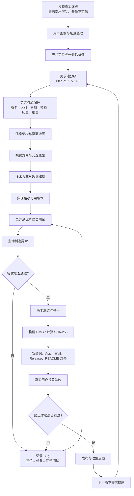
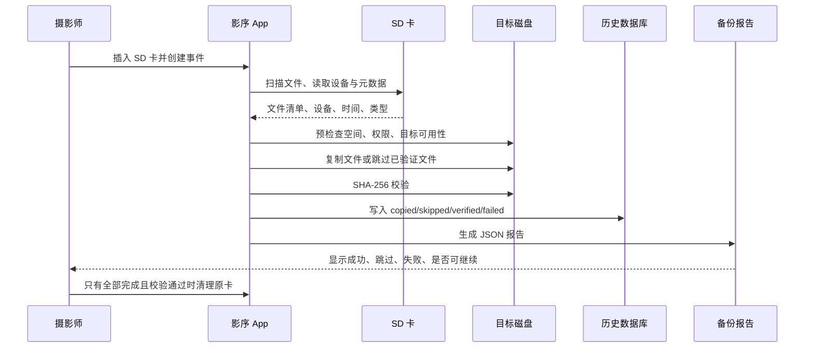

# 影序项目完整流程图

## 一、从想法到发布

## 二、每个阶段应该留下什么

| 阶段 | 必须产出 | 完成标准 |
|---|---|---|
| 痛点 | 用户场景、真实案例 | 能说清楚谁在什么情况下遇到什么问题 |
| 定位 | 一句话价值、目标用户 | 用户 10 秒内理解产品做什么 |
| 需求 | P0-P3 清单、验收条件 | 每个功能都有“完成”的客观定义 |
| 设计 | 页面地图、组件规范、交互流程 | 视觉、导航、语言状态统一 |
| 技术 | 架构图、数据模型、风险表 | 知道数据如何流动、失败如何恢复 |
| 开发 | 可运行版本、变更记录 | 核心闭环先跑通，不被高级功能拖住 |
| 测试 | 测试矩阵、日志、截图 | 正常路径和异常路径都可复现 |
| 发布 | DMG、SHA、Release、官网 | 所有公开入口指向同一个版本 |
| 复盘 | 时间线、Bug 地图、决策记录 | 下一次能直接复用，而不是重新摸索 |

## 三、影序的核心产品闭环

## 四、发布前的四道闸门

1. **功能闸门**：核心流程可以完成。
2. **安全闸门**：失败时原始数据不会被误删。
3. **一致性闸门**：App、DMG、官网、GitHub、README、SHA 版本一致。
4. **体验闸门**：普通用户能看懂、能操作、能找到结果。

任何一道闸门未通过，都不能称为正式发布。
